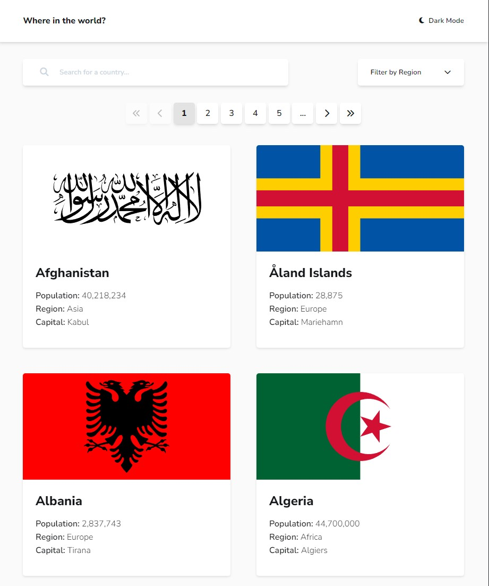
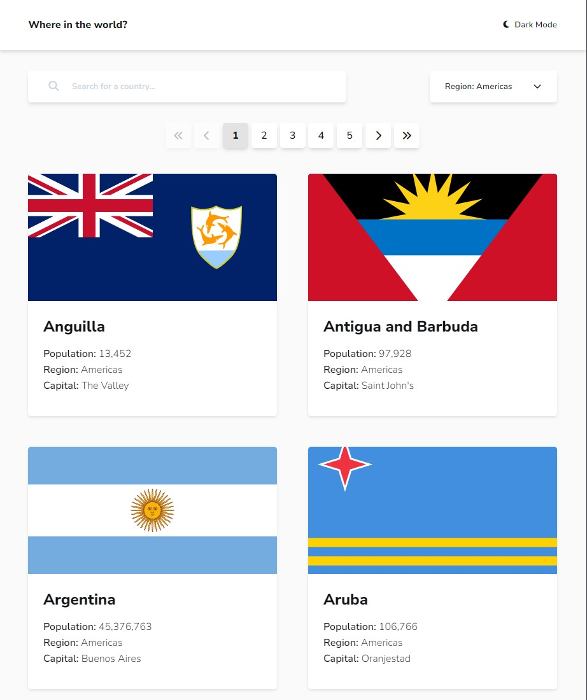
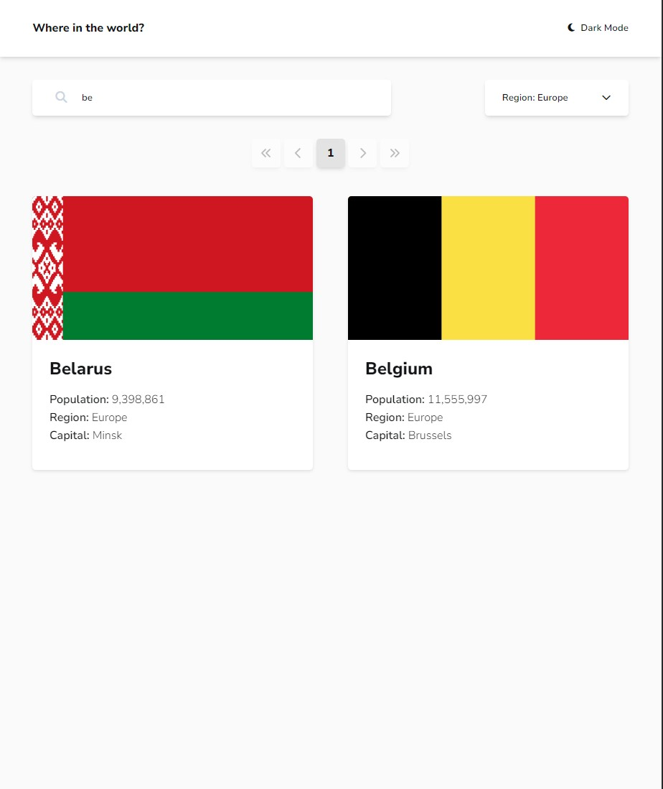
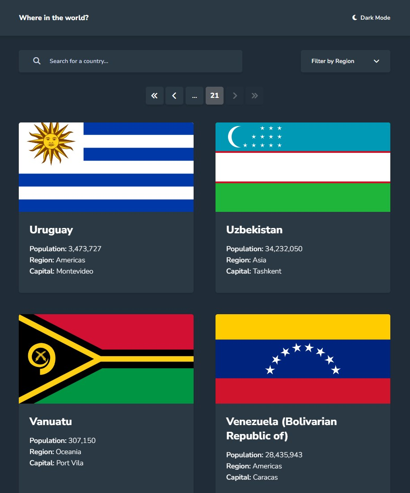
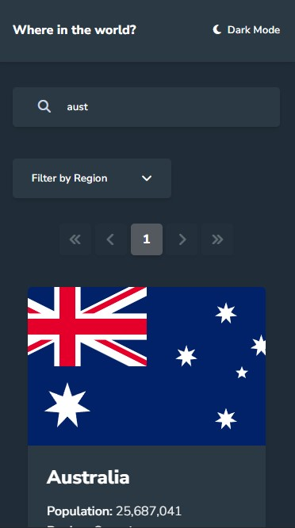
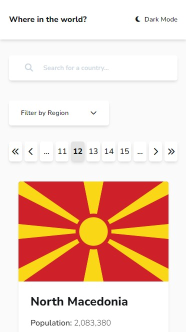

- Live Site URL: [here](https://kevinburle.github.io/rest-countries-api-theme-switcher-vanilla-js/)

# Frontend Mentor - REST Countries API with color theme switcher solution

This is a solution to the [REST Countries API with color theme switcher challenge on Frontend Mentor](https://www.frontendmentor.io/challenges/rest-countries-api-with-color-theme-switcher-5cacc469fec04111f7b848ca). Frontend Mentor challenges help you improve your coding skills by building realistic projects.

## Table of contents

- [Overview](#overview)
  - [The challenge](#the-challenge)
  - [Screenshot](#screenshot)
- [My process](#my-process)
  - [Built with](#built-with)
- [Author](#author)

## Overview

### The challenge

Users should be able to:

- See all countries from the API on the homepage
- Search for a country using an `input` field
- Filter countries by region
- Click on a country to see more detailed information on a separate page
- Click through to the border countries on the detail page

Some extra features I added:

- Data is fetched locally via the data.json file, but works the same way with the API link
- Cross filtering between input and dropdown list
- The API request is pulled once when the index.html load.
- Work with local storage to improve performance and reduce the number of API requests
- The regions in the dropdow filter are displayed dynamically according to the data from the API
- Countries Pagination, 12 countries are displayed per page by default to improve performance and UX (dynamic with filtering)
- Button pagination (5 buttons displayed by default) to improve UX/UI
- Possibility to go to the first or last page in one click via pagination
- Possibility to go to the next or previous page via pagination
- Numbers formatting with comma
- The countries names too long are truncated in the buttons (country page) to keep a clean UI 
- Toggle the color scheme between light and dark mode

### Screenshot

## My process

### Built with

- Semantic HTML5 markup
- CSS custom properties
- Flexbox
- CSS Grid
- ES6 import
- Mobile-first workflow
- Vanilla JavaScript
- No CSS framework used

## Author

- Frontend Mentor - [@kevinburle](https://www.frontendmentor.io/profile/kevinburle)
- Twitter - [@kevinburle](https://twitter.com/kevinburle)
